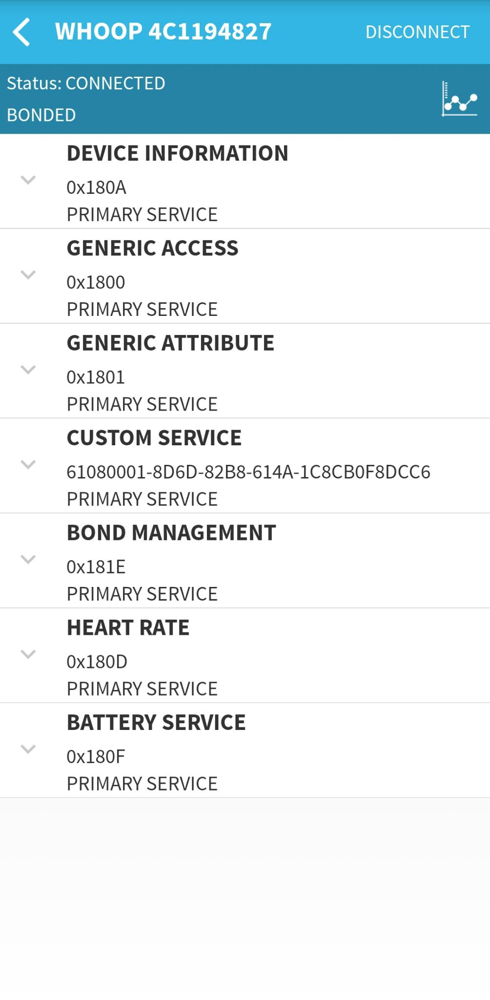
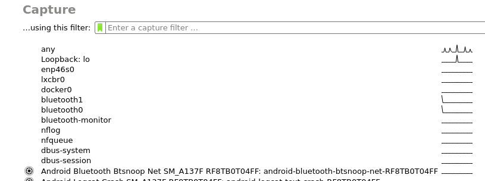
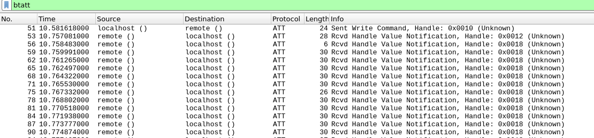
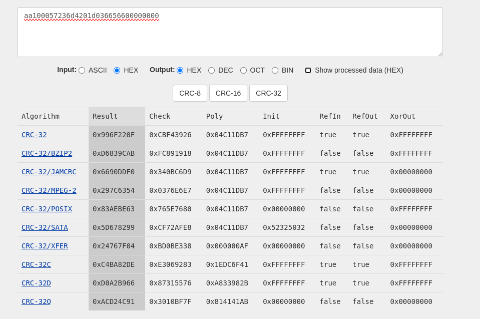
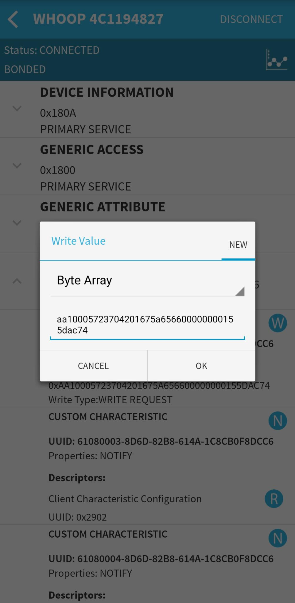

# Reverse Engineering Whoop 4.0 for fun and FREEDOM

Subscription services: hate them or loathe them, they sadly exist. More and more companies are moving towards them. It started with paying for subscriptions to watch movies and TV shows on Netflix, then free services added subscriptions to avoid ads, and then companies that sell physical devices started adding subscriptions to use them.

BMW wanted to include heated seats with a subscription, but after backlash, they dropped it. But many companies have them like [8sleep](https://www.eightsleep.com/), their sleep mattress for $2,500 and then require a subscription service to use it. But no company has gone further in this business model than [Whoop](https://www.whoop.com/). They don't even "sell" their device, instead, they sell membership for either one or two years and you get the device for "free".

### More reasons

Whoop has a few sensors: heart rate, temperature, and blood oxygen sensors, but temperature and blood oxygen are only measured once a day, during sleep. Its alarm can only be set to ring only once a day instead of for multiple periods.

## How?

The first step is general reconnaissance, how does device communicates with the app, what happens on the device and what happens on the phone...

What can the device do:

- [x] Measure heart rate
- [ ] Measure blood oxygen
- [ ] Measure temperature
- [x] Store and retrieve data
- [x] Vibrate as alarm

Let's see what can we learn from the device with a [BLE scanner](https://play.google.com/store/apps/details?id=com.macdom.ble.blescanner&hl=en_US)



We can see it has heart rate service, which means without any additional reverse engineering we can get heart rate from a device. We can assume most of the data between the device and app is exchanged using `CUSTOM SERVICE`. This service has a few characteristics:

| Characteristics | Name              | Writable | Readable | Notifiable | Handle |
| :-------------- | :---------------- | :------: | :------: | :--------: | :----: |
| 0x61080002      | CMD_TO_STRAP      |    +     |    -     |     -      | 0x0010 |
| 0x61080003      | CMD_FROM_STRAP    |    -     |    -     |     +      | 0x0012 |
| 0x61080004      | EVENTS_FROM_STRAP |    -     |    -     |     +      | 0x0015 |
| 0x61080005      | DATA_FROM_STRAP   |    -     |    -     |     +      | 0x0018 |
| 0x61080007      | MEMFAULT          |    -     |    -     |     +      | 0x001b |

(Names were gotten from the decompiled apk)

Since `CMD_TO_STRAP` is the only writable characteristic, and its name is `CMD_TO_STRAP` we can assume it is used to send commands to the device.

How can we see what data is sent to the device, there are multiple methods to do this:

First is using [adb](https://developer.android.com/tools/adb) bugreport to do this you first must enable it in `Developer Settings` under `Bluetooth HCI snoop logging`.

Bluetooth HCI logs can be extracted with the following commands:

```sh
adb bugreport logs
unzip logs.zip
wireshark FS/data/log/bt/btsnoop_hci.log
```

This is a good way to extract many logs and then extract data from them to check for correctness and get information being used but I prefer using Wireshark directly on the device while using the app, to do this enable connect a phone to compute and check if `adb` can see it using:

```sh
adb devices -l
```

If you see your device then it is connected after that just run [`Wireshark`](https://www.wireshark.org/), sudo is required

```sh
sudo wireshark
```



Select `Android Bluetooth Btsnoop ...`

After that filter for packets that use `Bluetooth Attribute Protocol` with `btatt`. Now that we only see `btatt` packages go over an app and you will see data getting exchanged between device and phone.

### Opening app

After opening the app, we can see the following in Wireshark:



We can see that the app sends data to the device using `CMD_TO_STRAP`, then we receive one notification on `CMD_FROM_STRAP` and many notifications on `DATA_FROM_STRAP`

Data being sent to `CMD_TO_STRAP` is

```
aa0800a823461600699b4cfb
```

Before we look at data being sent from the device let's try to see what data we send to the device. To help we can add filter `btatt.handle == 0x10`, to test commands let's try to connect to the device from a computer.

## Connecting to device

There are multiple ways to connect to the device both from your phone and from your computer. Some of them are [`hcitool`](https://linux.die.net/man/1/hcitool) and [`gatttool`](https://manpages.debian.org/unstable/bluez/gatttool.1.en.html), but I prefer using Python and `pygatt`.

Scanning for devices:

```py
from pygatt import GATTToolBackend, BLEAddressType

adapter = GATTToolBackend(hci_device='hci0')
adapter.start()

for device in adapter.scan(timeout=5):
    print(device)
```

This will scan for devices for 5 seconds and print them out, to connect to the device:

```py
device = adapter.connect('XX:XX:XX:XX:XX:XX', address_type=BLEAddressType.random)
```

### Alarm

Let's go to an app set an alarm to time and see what data the device sends:

```
aa10005723  6d  4201    d0366566    00000000    f62deb81 # 7:00 Exact time
aa10005723  6e  4201    0c376566    00000000    1023ccef # 7:01 Exact time
aa10005723  6f  4201    207d6566    00000000    fea1e060 # 12:00 Exact time
aa10005723  70  4201    50116566    00000000    f226a8bd # 4:20 Exact time
aa10005723  81  4201    f07e6666    00000000    7037c2a4 # Peak 06:20
aa10005723  82  4201    f07e6666    00000000    7151203d # Perform 06:20
aa10005723  83  4201    f07e6666    00000000    b18eaefc # In the Green 06:20
```

Let's examine the packages sent:

- The first 5 bytes are package header: `aa10005723`
- The next byte seems to be some package count it increments by 1 every time
- The next 2 bytes are the same on all packages so they might be some flags
- The next 4 bytes are unix timestamp that corresponds to the next time an alarm needs to ring
- The next 8 bytes seem to be padding
- The next 8 bytes seem to be checksum

It seems that sleep goal is handled on a phone, and if sleep is in green range alarm new alarm time gets sent to the device. Now let's try to set an alarm to ring in 10 seconds. First, let's see if it checks package count and checksum

```py
unix_time = int(time.time()) + 10
unix = struct.pack('<I', unix_time).hex()

package = f"aa10005723704201{unix}00000000f226a8bd"

device.char_write("61080002-8d6d-82b8-614a-1c8cb0f8dcc6", bytearray.fromhex(package), wait_for_response=False)
```

And it doesn't work, now let's see what kind of checksum is used:

```
aa100057236d4201d036656600000000    f62deb81
aa100057236e42010c37656600000000    1023ccef
aa100057236f4201207d656600000000    fea1e060
aa100057237042015011656600000000    f226a8bd
```

#### Simple Solution

Go to [crccalc.com](https://crccalc.com/), paste data and select `hex` for Input and `CRC-32`



And no luck, let's try to reverse engineer checksum, [@colinoflynn](https://github.com/colinoflynn) created a python package to reverse engineer CRCs, [crcbeagle](https://github.com/colinoflynn/crcbeagle) so first clone it and enter it:

```sh
git clone https://github.com/colinoflynn/crcbeagle
cd crcbeagle
touch examine.py
```

And then copy the following script to `examine.py`, in your example put your packages in the data

```py
from crcbeagle.crcbeagle import CRCBeagle

crc = CRCBeagle()

def hex_to_int(hex):
    return [i for i in bytearray.fromhex(hex)]

data = """
aa100057236d4201d036656600000000f62deb81
aa100057236e42010c376566000000001023ccef
aa100057236f4201207d656600000000fea1e060
aa100057237042015011656600000000f226a8bd
""".split('\n')

data = [i for i in data if i]
checksums = [i[len(i) - 8:] for i in data]
data = [i[:len(i) - 8] for i in data]


crc.search(
    [hex_to_int(i) for i in data],
    [hex_to_int(i) for i in checksums]
)
```

Output provides code for checksums:

```py
import struct
from crccheck.crc import Crc32Base
crc = Crc32Base
def my_crc(message):
    crc._poly = 0x4C11DB7
    crc._reflect_input = True
    crc._reflect_output = True
    crc._initvalue = 0x0
    crc._xor_output = 0xF43F44AC
    output_int = crc.calc(message)
    output_bytes = struct.pack("<I", output_int)
    output_list = list(output_bytes)
    return (output_int, output_bytes, output_list)

m = [170, 16, 0, 87, 35, 109, 66, 1, 208, 54, 101, 102, 0, 0, 0, 0]
output = my_crc(m)
print(hex(output[0]))
```

Now let's add a checksum to the package we send:

```py
package = f"aa10005723704201{unix}00000000"
checksum = my_crc(bytearray.fromhex(package))
package = f"{package}{checksum}"

device.char_write("61080002-8d6d-82b8-614a-1c8cb0f8dcc6", bytearray.fromhex(package), wait_for_response=False)
```

And no go, sometimes it throws an error and sometimes it just doesn't, so it is possible that this is the error sending and our package is good, so let's send data from the [BLE scanner](https://play.google.com/store/apps/details?id=com.macdom.ble.blescanner&hl=en_US)



And it works. So why it doesn't work with a computer, I don't know... I have tried to do it with another library [`bleak`](https://github.com/hbldh/bleak), and it doesn't work, so the next try is with [`gatttool`](https://manpages.debian.org/unstable/bluez/gatttool.1.en.html):

```sh
sudo gatttool -i hci0 -t random -b XX:XX:XX:XX:XX:XX --char-write -a 0x0010 -n aa10005723704201126d6566000000003d59d8fd
```

And this "works", it works randomly but it is good enough for me.

### Broadcast heart rate

With Wireshark opened, toggle `BROADCAST HEART RATE`, these are the packages sent:

```
aa0800a823070e00c7e40f08 # Off
aa0800a823080e016c935474 # On
aa0800a823090e00cdc99102 # Off
```

After running [`enable_notifications.py`](https://github.com/hbldh/bleak/blob/develop/examples/enable_notifications.py) with notifications off:

```sh
python3 enable_notifications.py --address XX:XX:XX:XX:XX:XX 00002a37-0000-1000-8000-00805f9b34fb
```

It gets `ERROR: could not find device with address 'XX:XX:XX:XX:XX:XX'`, but after having notifications enabled it connects and prints heart rate, so after running:

```sh
sudo gatttool -i hci0 -t random -b XX:XX:XX:XX:XX:XX --char-write -a 0x0010 -n aa0800a823070e00c7e40f08
```

and rerunning `enable_notifications.py` it fails, and after running it works:

```sh
sudo gatttool -i hci0 -t random -b XX:XX:XX:XX:XX:XX --char-write -a 0x0010 -n aa0800a823080e016c935474
```

This means that the packet count is not checked and used at all.

### Start an activity

After starting an activity packet gets sent and after it, notifications on `DATA_FROM_STRAP` get received every second. These packages have the same header and format as packages for [Broadcast heart rate](#broadcast-heart-rate).

```
aa0800a823  8c  03  01  7d5ec627 # Starting
aa0800a823  8d  03  00  dc040351 # Exiting
aa0800a823  90  03  01  6904fa32 # Start
aa0800a823  91  03  00  c85e3f44 # Exit
aa0800a823  8f  03  00  b2d08752 # Sleep start
aa0800a823  07  0e  00  c7e40f08 # Heart Rate Broadcast Off
aa0800a823  08  0e  01  6c935474 # Heart Rate Broadcast On
aa0800a823  09  0e  00  cdc99102 # Heart Rate Broadcast Off
aa0800a823  05  03  00  e44e25be # Health Monitor off
aa0800a823  06  03  01  2bc064cb # Health Monitor on
aa0800a823  66  74  01  3ae4cde3 # -||-
aa0800a823  91  45  01  dd861b95 # Alarm off
aa0800a823  0e  16  00  1147c585 # This command seems to retrieve data
```

Packet structure

1. The first 5 bytes are the header
2. The next byte is a packet count
3. The next byte is a category:
   - `0x03` is used to start/end activity and recording
   - `0x0e` is used to enable/disable the broadcast heart rate, it seems that the app can't read this value from the device, so if in the app it is set to enabled, it sends `01` every once in a while
   - `0x14` always sent with value `00`
   - `0x16` is used to trigger data retrieval on `DATA_FROM_STRAP`, this is also a command that gets sent after the alarm is tapped, value is always `00`
   - `0x23` gets sent during the sync
   - `0x24` is used to get some string from the device
   - `0x43` IDK
   - `0x45` IDK
   - `0x4c` is used to get the device name
   - `0x73` returns notification on `CMD_FROM_STRAP` with `01`
   - `0x74` returns notification on `CMD_FROM_STRAP` with `01`, notification sometimes has data in string and sometimes it is empty
   - `0x75` IDK
   - `0x76` IDK
4. The next byte is on/off
5. The last 4 bytes are checksum

After listening on `DATA_FROM_STRAP` with

```sh
python3 enable_notifications.py --address XX:XX:XX:XX:XX:XX 61080005-8d6d-82b8-614a-1c8cb0f8dcc6
```

And running:

```sh
sudo gatttool -i hci0 -t random -b XX:XX:XX:XX:XX:XX --char-write -a 0x0010 -n aa0800a8238c03017d5ec627
```

We receive a notification every second and after running, they stop:

```sh
sudo gatttool -i hci0 -t random -b XX:XX:XX:XX:XX:XX --char-write -a 0x0010 -n aa0800a8238d0300dc040351
```

This is the data received after starting an activity:

```
Header          Unix        S       HR  RR  RR data                 Checksum
aa1800ff2802    ad896566    f065    42  01  67060000000000000101    3ba00d4d
aa1800ff2802    ae896566    f860    43  00  00000000000000000101    5025f793
aa1800ff2802    af896566    085c    42  00  00000000000000000101    add7df13
aa1800ff2802    b0896566    1057    42  00  00000000000000000101    24b22179
aa1800ff2802    b1896566    1852    42  00  00000000000000000101    e0a905b8
aa1800ff2802    b2896566    284d    42  00  00000000000000000101    d943226a
aa1800ff2802    b3896566    3848    43  00  00000000000000000101    28364865
aa1800ff2802    b4896566    4043    43  00  00000000000000000101    9c2e99ba
aa1800ff2802    b5896566    503e    43  00  00000000000000000101    ebb8a1ce
aa1800ff2802    b6896566    5039    43  00  00000000000000000101    d1635459
aa1800ff2802    b7896566    6834    43  00  00000000000000000101    ccefa569
aa1800ff2802    b8896566    702f    43  00  00000000000000000101    8770ff99
aa1800ff2802    b9896566    802a    43  00  00000000000000000101    d2299e02
aa1800ff2802    ba896566    8825    44  00  00000000000000000101    3cd6a988
aa1800ff2802    bb896566    9020    44  00  00000000000000000101    94f13f2f
aa1800ff2802    bc896566    a01b    44  00  00000000000000000101    c8ed7785
aa1800ff2802    bd896566    b016    44  00  00000000000000000101    3b07bb4b
```

These are also the same packages that are received when `Health Monitor` gets opened.

### Random text command

```
aa4800f323b8780167656e6572616c5f61625f74657374000000000000000000000000000000000032000...00625af8c
aa4800f323b9780173696770726f635f31305f7365635f647000000000000000000000000000000032000...0458e3fdb
aa4800f323ba780173696770726f635f70646166000000000000000000000000000000000000000032000...09334bc6a
aa4800f323bb7801656e61626c655f7231395f7061636b657473000000000000000000000000000032000...05db99544
aa4800f32346780167656e6572616c5f61625f74657374000000000000000000000000000000000032000...05c04a6f4
aa4800f32347780173696770726f635f31305f7365635f647000000000000000000000000000000032000...01faf36a3
aa4800f32348780173696770726f635f70646166000000000000000000000000000000000000000032000...02cb908fb
aa4800f323497801656e61626c655f7231395f7061636b657473000000000000000000000000000032000...0e23421d5
aa4800f323b5780167656e6572616c5f61625f74657374000000000000000000000000000000000032000...0bb6d53e8
aa4800f323b6780173696770726f635f31305f7365635f647000000000000000000000000000000032000...00908317e
aa4800f323b7780173696770726f635f70646166000000000000000000000000000000000000000032000...02e7c400e
aa4800f323b87801656e61626c655f7231395f7061636b657473000000000000000000000000000032000...0f4932608
aa4800f32328780167656e6572616c5f61625f74657374000000000000000000000000000000000032000...06418c0fc
aa4800f32329780173696770726f635f31305f7365635f647000000000000000000000000000000032000...027b350ab
aa4800f3232a780173696770726f635f70646166000000000000000000000000000000000000000032000...0f109d31a
aa4800f3232b7801656e61626c655f7231395f7061636b657473000000000000000000000000000032000...03f84fa34
```

These packets consist of header `aa4800f323`, `u16` number, string and 32-bit checksum, decoded:

```
aa4800f323 47224     general_ab_test2           0625af8c
aa4800f323 47480     sigproc_10_sec_dp2         458e3fdb
aa4800f323 47736     sigproc_pdaf2              9334bc6a
aa4800f323 47992     enable_r19_packets2        5db99544
aa4800f323 18040     general_ab_test2           5c04a6f4
aa4800f323 18296     sigproc_10_sec_dp2         1faf36a3
aa4800f323 18552     sigproc_pdaf2              2cb908fb
aa4800f323 18808     enable_r19_packets2        e23421d5
aa4800f323 46456     general_ab_test2           bb6d53e8
aa4800f323 46712     sigproc_10_sec_dp2         0908317e
aa4800f323 46968     sigproc_pdaf2              2e7c400e
aa4800f323 47224     enable_r19_packets2        f4932608
aa4800f323 10360     general_ab_test2           6418c0fc
aa4800f323 10616     sigproc_10_sec_dp2         27b350ab
aa4800f323 10872     sigproc_pdaf2              f109d31a
aa4800f323 11128     enable_r19_packets2        3f84fa34
```

I am not sure what this is, it gets sent randomly

## Sync Process

To see how to retrieve data from the device, I turned off Bluetooth overnight and recorded packages during sync, the first thing I noticed is that the app asks for the journal then after sending requests it fails, and the app asks for the journal again after sync and after that, it succeeds.

After the phone connects to the device, a bunch of notifications are received on `DATA_FROM_STRAP` the last one received has a following format:

```
                      unix      don't care      batch N                     checksum
aa1c00ab31  18  02    f65c7066  804043000000    2e470100    04000000000000  7f873cf3
aa1c00ab31  19  02    fb5c7066  704143000000    2e470100    04000000000000  f277ceb0
aa1c00ab31  1a  02    005d7066  684243000000    2e470100    04000000000000  6b7b573f
aa1c00ab31  1b  02    055d7066  684343000000    2e470100    04000000000000  0b876f87
```

The important part is `batch N` which needs to be sent in the following format to trigger the next burst of notifications:

```
aa10005723{packet count}1701{batch N}00000000{checksum}
```

After this notifications on `DATA_FROM_STRAP` start being received, these packets are very large(96 bytes):

First 31 bytes:

```
Header              Time?           Unix?       Something       HR  RR  RR data
aa5c00f02f0c    07  8bb7    0900    c8326966    e03c8054cc01    58  01  b902000000000000
aa5c00f02f0c    07  8cb7    0900    c9326966    f0378054cc01    58  01  b502000000000000
aa5c00f02f0c    07  8db7    0900    ca326966    f8328054cc01    58  02  b802b90200000000
aa5c00f02f0c    07  8eb7    0900    cb326966    082e8054cc01    58  01  ce02000000000000
aa5c00f02f0c    07  8fb7    0900    cc326966    10298054cc01    58  01  c102000000000000
aa5c00f02f0c    07  90b7    0900    cd326966    20248054cc01    58  02  df02d30200000000
aa5c00f02f0c    07  91b7    0900    ce326966    281f8054cc01    57  01  f802000000000000
aa5c00f02f0c    07  92b7    0900    cf326966    381a8054cc01    57  01  fb02000000000000
```

Remaining 65 bytes, I have no idea what it is:

```
00004563f880c9143cae47afbe5ccf5b3ef6a4753f00008e46ae47afbe5ccf5b3ef6a4753fe50146021c03440282016004010c020c3000000000000002  2dcbe388
0000cf6bff00e8e23b5248afbe66265c3e0078753f0000c8465248afbe66265c3e0078753fe50146022003460282016004010c020c3000000000000002  4d49cb2e
0000f96dff00a7e73b140eafbe298c5b3e715d753f00001046140eafbe298c5b3e715d753fe50146022003470282016004010c020c3000000000000002  833a28fd
0000a16eff0070b43b1fedaebe3d9a5b3ecd34753f00005ac61fedaebe3d9a5b3ecd34753fe50146022003450282016004010c020c3000000000000002  149f6d4f
00008b63ff0041a43b14e6aebea4b05b3e4819753f0000c0c514e6aebea4b05b3e4819753fe50146021e03450282016004010c020c3000000000000002  a4d38c63
00004661ff001bb03b8fcaaebe1fd55b3e0008753f0000b2c68fcaaebe1fd55b3e0008753fe50146021d03440287016004010c020c3000000000000002  2891f236
0000d161ff00f3a43ba480aebe859b5b3ed7e7743f0000e046a480aebe859b5b3ed7e7743fe50146021d03450287016004010c020c3000000000000002  c197f209
0000f961ff0041fd3b7bb4aebeae475b3e1fd9743f000082467bb4aebeae475b3e1fd9743fe50146021d03440287016004010c020c3000000000000002  aec41896
0000a16aff0061c63b48a1aebe3d0a5c3e66aa743f0000d84548a1aebe3d0a5c3e66aa743fe50146021c03440287016004010c020c3000000000000002  dfafea59
00008c6aff00c8b43bec71aebe33c35b3e9ac1743f000050c5ec71aebe33c35b3e9ac1743fe50146021c03440287016004010c020c3000000000000002  76ae1006
```

And then two `Enable` commands get sent at the end:

```
aa0800a823  15  73  01    f4a43bfa
aa0800a823  16  74  01    6a8c3cb7
```

### Erase device

When the erase device button is pressed following package gets sent:

```
aa10005723cf19fefefefefefefefe002f8744f6
aa10005723d219fefefefefefefefe00e30e2693
aa10005723d319fefefefefefefefe0023d1a852
```

### Reboot device

For reboot device following packages get sent:

```
aa0800a823d41d003c2e2fe6
aa0800a823da1d003603b1ec
aa0800a823df1d00ddc17aea
aa0800a823e21d001eb7c9c6
```

## Events

On `EVENTS_FROM_STRAP` multiple packages get received, I am not sure what these packages have, the unix timestamp in them doesn't represent any start or end

```
header             unix                                                                    checksum
aa2400fa30 b0 0300 2e316966 901f 140002 e900 0000 e90e 0000 01 01 0f 03 01 00 2f 01 000000 699d4a60
aa2400fa30 64 0300 6a316966 d02e 140002 f100 0000 ed0e 0000 01 01 01 04 01 00 2e 01 000000 2d6beb1e
aa2400fa30 28 0300 a6316966 703d 140002 f900 0000 f00e 0000 01 01 37 04 01 00 2d 01 000000 50e4148e
aa2400fa30 f3 0300 e2316966 584c 140002 0101 0000 f20e 0000 01 01 31 05 01 00 2c 01 000000 0a6472e1
aa2400fa30 57 0300 1e326966 a05a 140002 0901 0000 f60e 0000 01 01 23 06 01 00 2b 01 000000 b6aff508
aa2400fa30 6b 0300 5a326966 5869 140002 1101 0000 fb0e 0000 01 01 15 07 01 00 2b 01 000000 b584c4fc
aa2400fa30 76 0300 96326966 a877 140002 1901 0000 4a0f 0000 01 01 07 08 01 00 2a 01 000000 f6cfde23
aa2400fa30 87 0300 d3326966 c805 140002 2101 0000 480f 0000 01 01 35 08 01 00 29 01 000000 7586b95f
aa2400fa30 a1 0300 0f336966 d013 140002 2901 0000 4b0f 0000 01 01 2f 09 01 00 28 01 000000 b7d66926
aa2400fa30 ac 0300 4b336966 f020 140002 3101 0000 480f 0000 01 01 21 0a 01 00 27 01 000000 5b22a14b
aa2400fa30 b7 0300 87336966 682e 140002 3901 0000 4f0f 0000 01 01 13 0b 01 00 26 01 000000 bc513013
aa2400fa30 c5 0300 c3336966 f03b 140002 4101 0000 500f 0000 01 01 05 0c 01 00 25 01 000000 2849050a
```

The same goes for these packets:

```
header             unix               checksum
aa10005730 5b 2100 3f326966 6854 0000 b0b2435b
aa10005730 65 2200 45326966 a866 0000 093b5aa6
aa10005730 66 1800 48326966 3012 0000 ef5360f0
aa10005730 81 1800 ba326966 2873 0000 9b28989f
aa10005730 6a 2100 e45e6866 e068 0000 323b066b
aa10005730 6e 2200 e85e6866 2843 0000 1489a6e0
aa10005730 70 1800 135f6866 f810 0000 f05e2f2f
aa10005730 75 1500 1c5f6866 b003 0000 55066632
aa10005730 76 0700 1c5f6866 a005 0000 ac1a4bdc
```

All packages received on `EVENTS_FROM_STRAP` have the header, counter, some 8-bit number, `00`, unix timestamp and then some data, but none of the unix times correspond to any activity starts or endings.

Part 2 with blood oxygen and temperature measuring coming soon
